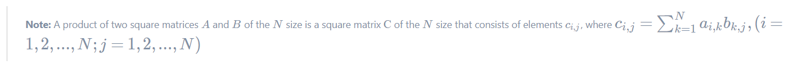

# Exam_06_01. Multiplying square matrices 
The russian version of the task can be found in the repository.

## Task

| Exam_06_01 | |
| ------ | ------ |
| Level: | 4 |
| Topics: | Matrices. |
| Directory for the solution: | src/ |
| Solution files: | main.c |
| Input data: | Standard input stream (stdin) |
| Output data: | Standard output stream (stdout) |

Create a program that multiplies two square matrices `A` and `B` of the `N` size. 
The `N` size is specified in the standard input stream–stdin; it is followed 
by `N^2` integers that describe the `A` matrix, row by row, and `N^2` integers 
that describe the `B` matrix, row by row. The result of multiplication of 
matrices `C = A * B` should be output to the standard output 
stream–stdout–as a table (there must be a line break after each output 
row of the `C` matrix); the elements must be separated by spaces, and 
there must be no spaces before the line break. There should be no newline 
break at the end of the response. Check the validity of the entered data. 
In case of any error, output "n/a".

## Examples

| Input | Output |
| ------ | ------ |
| 2 1 2 3 4 5 6 7 8 | 19 22 43 50 |

> **Attention:** We kindly remind you that the procedure for testing your program includes an analysis of the code style. Please look in the "materials /" folder. Also, be sure to check your program for memory leaks!
